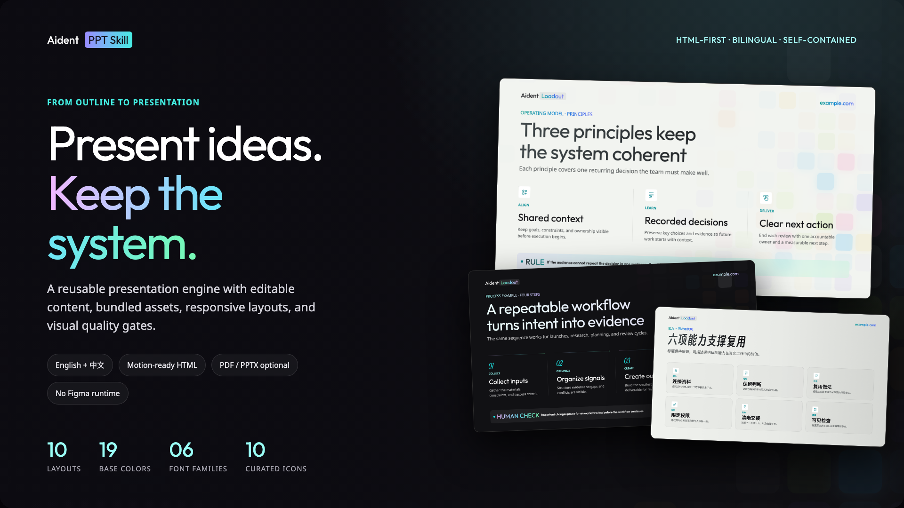
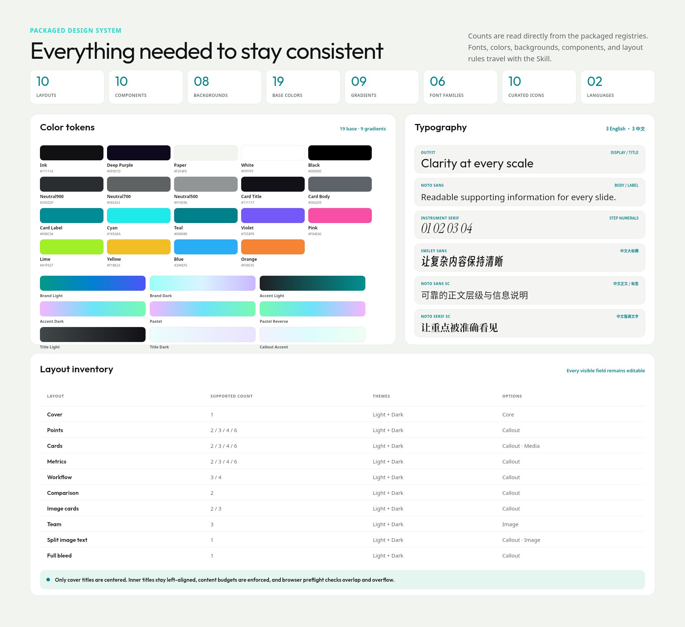
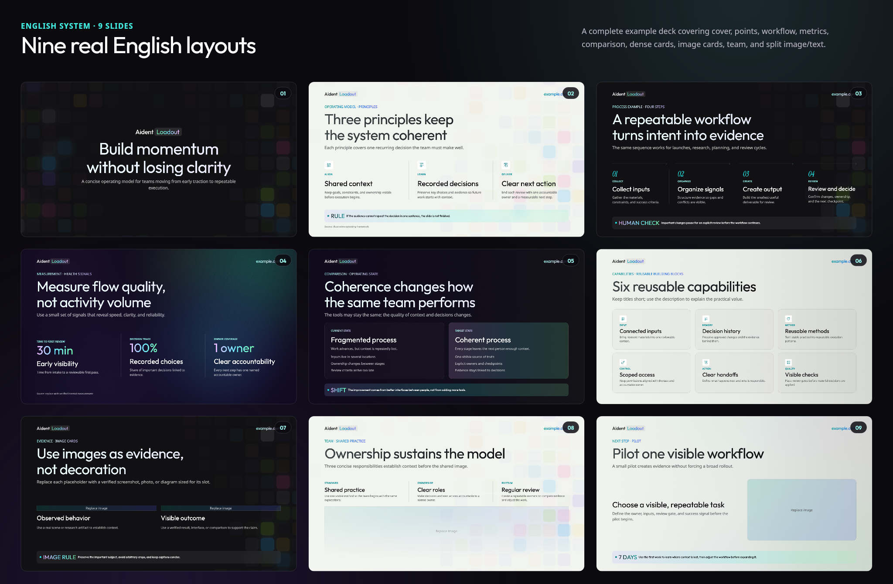
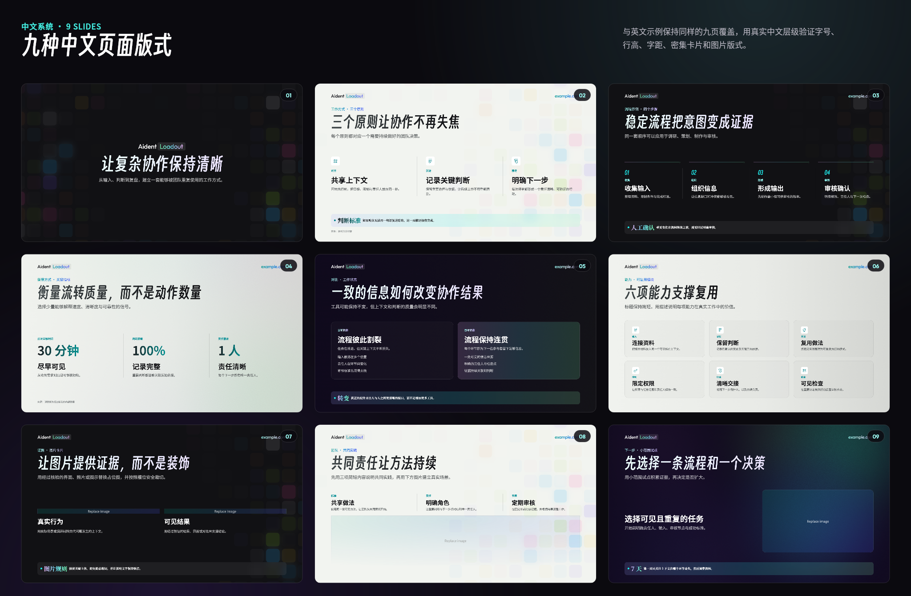

# Aident PPT Skill



[中文](./README.md) · [Skill instructions](./SKILL.md) · [Page layout catalog](./references/layout-catalog.md) · [Multi-Agent workflow](./references/multi-agent-workflow.md)

A self-contained bilingual presentation Skill that turns an audience, objective, and content outline into consistent HTML presentations by default. Single-file webpages, PDFs, and editable PPTX decks are optional outputs. Layouts, components, typography policy, icons, backgrounds, and quality gates are packaged with the Skill. Public visibility does not place every branded asset under an open-source license; read [NOTICE.md](./NOTICE.md) before use or redistribution.

Bring your own brand: replace the cover and upper-left slide mark with your own PNG, JPG/JPEG, WebP, or SVG. Use one logo for both themes or provide separate Light/Dark files; the source aspect ratio is always preserved.

## The system at a glance / 一眼看懂这套系统

The preview is generated from packaged registries and bundled fonts. / 下图由包内 registry 与字体文件生成。



| Packaged capability / 已打包能力 | Count / 数量 | Includes / 包含内容 |
|---|---:|---|
| Page layouts / 页面版式 | 10 | Cover、Points、Cards、Metrics、Workflow、Comparison、Image Cards、Team、Split、Full-bleed |
| Component types / 组件类型 | 10 | Header、Source、Point、Step、Metric、Callout、Card、Workflow、Comparison、Image Mask |
| Background treatments / 背景处理 | 8 | Light / Dark × Base、Elements Cover、Elements Inner、Atmosphere |
| Raster asset policy / 位图策略 | Lossless WebP | Backgrounds, textures, Hero, and Showcase preserve decoded pixels; PPTX converts to PNG in memory / 背景、纹理与预览均为无损 WebP，PPTX 内存转 PNG |
| Color system / 颜色系统 | 19 base + 9 gradients | Semantic colors、title gradients、emphasis gradients、Callout gradient / 语义色、标题、强调与 Callout 渐变 |
| Fonts / 字体 | 6 bundled families / 6 套 | 3 English + 3 Chinese families with licenses and role index / 英文 3 套 + 中文 3 套，包含许可与角色索引 |
| Icons / 图标 | 10 × Light / Dark | Curated from the existing design system; no redrawn glyphs / 来自现有设计系统，不自行描画 |
| Languages / 语言 | 2 | Independent English and Chinese type hierarchy, line height, and tracking / 中英文独立字体层级、行高与字距 |

## Complete nine-slide coverage in both languages / 中英文完整九页覆盖

### English example / 英文示例

Nine real layouts covering cover, points, workflow, metrics, comparison, dense cards, image cards, Team, and split image/text. / 九种真实版式覆盖封面、要点、流程、指标、对比、密集卡片、图片卡片、团队与左文右图。



### Chinese example / 中文示例

The Chinese deck validates its own typography and spacing tokens. / 中文示例使用独立的字体层级与间距 token。



## Quick start

### Install

Copy the complete directory into the Skill folder used by your Agent. Do not copy only `SKILL.md`; the assets, fonts, runtime, scripts, and references are required.

Codex:

```bash
cp -R /path/to/aident-ppt-skill ~/.codex/skills/aident-ppt-skill
```

Claude Code:

```bash
cp -R /path/to/aident-ppt-skill ~/.claude/skills/aident-ppt-skill
```

Other local Agent environments need file access, Node.js 20+, and browser preview support. If this Skill is later published to Git or skills.sh, install the complete repository using that platform's installer and keep the Skill name `aident-ppt-skill`.

```bash
npx skills add https://github.com/jzs3660/aident-ppt-skill --skill aident-ppt-skill
```

### Prompt the Agent

```text
Use $aident-ppt-skill to make an 8-slide English strategy presentation.
The audience is business leadership. Explain the current situation, three opportunities,
an implementation workflow, and success measures. Deliver folder HTML only unless I explicitly request PDF or editable PPTX.
Use realistic generic placeholders, show example.com in the header, and do not invent
customers, revenue, or performance claims. I will supply a replaceable logo and images.
```

### Run an example

```bash
node scripts/check-fonts.mjs
node scripts/generate-deck.mjs \
  --input examples/deck.example.en.json \
  --out output/example-en
```

Open `output/example-en/index.html`; press `P` for presenter mode.

## What is included

- Defined English and Chinese type roles, sizes, line heights, and tracking.
- A fixed 1920×1080, 16:9 canvas and reusable layout system.
- Light/dark backgrounds, texture overlays, gradient text, kickers, callouts, and contrast treatments; Elements is split into Cover/Inner while Atmosphere is available to Light/Dark inner slides.
- Point, Card, and Metric combinations for 2/3/4/6 items; Workflow combinations for 3/4 steps.
- Image cards, team mask, split image/text, full-bleed, and comparison layouts.
- Optional label, icon, header, source, callout, and workflow-arrow variants.
- All slide copy is data-driven and editable: kickers, titles, subtitles, every Point/Card/Metric/Step/Comparison field, values, lists, callouts, sources, and speaker notes.
- Replaceable logos, header text/URL, content images, crop positions, and sources.
- Folder HTML as the default deliverable; single-file HTML, PDF, editable PPTX, and static web delivery on request.
- Folder HTML copies only assets referenced by the current deck plus the font faces/licenses required by its language and used components; it never copies the entire packaged `assets` tree.
- Packaged backgrounds, textures, Hero, and Showcase images are Lossless WebP; logos/icons remain SVG; PPTX converts referenced WebP files to cached PNG buffers without storing duplicate compiled backgrounds.
- Responsive ordinary, audience, and embed views keep the full 1920×1080 canvas centered and visible without cropping the right or bottom edge.
- Navigation, overview, restrained animation, low-power mode, and presenter view.
- Static validation, browser overlap/overflow checks, and rendered PDF/PPTX review.
- Both a single-Agent workflow and an executable multi-Agent workflow with ownership, handoffs, deterministic assembly, and parallel QA.

## Good fit / poor fit

Good fit: external proposals, product introductions, strategy reviews, operating frameworks, team/process stories, and polished decks with a small number of meaningful metrics or images.

Poor fit: spreadsheet-heavy reports, training manuals that require dense page-level detail, raw transcripts without editorial restructuring, or real-time co-editing of one PPTX file. For the last case, complete collaborative content editing first, then generate the publication deck with this Skill.

## Output formats

| Need | Recommended output | Notes |
|---|---|---|
| Motion, presenter notes, web delivery | Folder HTML | Most faithful visual and interaction target |
| Portable offline delivery | Single-file HTML | Assets are embedded; file size is larger |
| Print or locked appearance | PDF | Fixed 16:9 pages, not editable |
| Continued PowerPoint editing | PPTX | Native text and main shapes; some web effects are approximated |
| Static hosting | Folder HTML | Deploy to any HTTPS static host |

HTML is the default primary renderer and deliverable. PDF and PPTX are exported only when explicitly requested. PDF is exported from that HTML, while PPTX is authored from the same resolved JSON as native text, shapes, images, and speaker notes.

Validated HTML is the visual source of truth. PPTX is an optional editable adapter; if the target machine substitutes a bundled font or PowerPoint uses different glyph metrics, final manual adjustment may be needed. Do not compromise the HTML layout to imitate a PowerPoint fallback renderer.

JSON plus HTML is used because an Agent can reliably read, edit, and validate structured content and CSS geometry. The same source can drive web motion, PDF, and native PPTX without recovering text from flattened design screenshots.

## Single-Agent workflow

Use this for a small deck, simple asset requirements, or one output format.

1. Read `SKILL.md` and only the references needed for the task.
2. Normalize the request into audience, purpose, narrative, and takeaway titles.
3. Select registered layouts and supported item counts.
4. Author schema-valid `deck.json`.
5. Resolve fonts and image paths.
6. Generate and validate folder HTML; export PDF/PPTX only if requested.
7. Run automated and page-by-page visual QA for every requested format.

See [SKILL.md](./SKILL.md) for the complete operating instructions.

## Multi-Agent workflow

Use this for 10+ slides, multiple sources, concurrent format delivery, or an explicit request for parallel Agents. Multiple Agents do not edit the same deck. They create bounded handoffs under a single-writer contract.

```text
Lead / Orchestrator
  ├─ Narrative Architect ──> handoffs/narrative.json
  ├─ Asset Curator ────────> handoffs/assets.json
  └─ Notes Editor ─────────> handoffs/notes.json
               │
               v
         Lead assembles deck.json
               │
       HTML / optional PDF / optional editable PPTX
               │
  ┌────────────┼────────────┐
  v            v            v
HTML QA      PDF QA       PPTX QA
```

The canonical roles are in [`agents/roles.json`](./agents/roles.json), repository ownership rules are in [`AGENTS.md`](./AGENTS.md), and assignment-ready role prompts are in [`agents/prompts/`](./agents/prompts/).

Initialize a run:

```bash
node scripts/init-multi-agent-run.mjs \
  --brief /absolute/path/brief.md \
  --out /absolute/path/run \
  --language en \
  --formats html
```

After specialists write their owned handoffs:

```bash
node scripts/validate-agent-run.mjs --run /absolute/path/run --phase planning
node scripts/assemble-agent-run.mjs --run /absolute/path/run
node scripts/validate-agent-run.mjs --run /absolute/path/run --phase assembled
```

The narrative must be `complete`; assets and notes must be `complete` or explicitly `waived`. Unknown slide IDs, duplicate IDs, invalid item indices, and overlapping write ownership fail validation.

Format QA Agents review but do not fix final files. The lead regenerates after corrections and runs the final gate:

```bash
node scripts/validate-agent-run.mjs --run /absolute/path/run --phase release
```

Release requires every requested artifact and a matching passing QA report. See [multi-agent-workflow.md](./references/multi-agent-workflow.md) for scheduling, failure recovery, and assignment patterns for Codex, Claude Code, Cursor, and similar local Agents.

## Non-negotiable design rules

- Only the cover title is centered; every inner-page title is left-aligned.
- Every slide uses a registered background and texture treatment.
- `150%` line height means 1.5 times the font size, never `150px`.
- Point, Card, Step, and Metric titles are one line by default.
- Workflow arrows occupy a separate row 32px above the complete Step row, with one arrow above every Step including the final Step; Step numbers are `#008089` on Light and `#1EEAEA` on Dark.
- Text, cards, callouts, images, headers, and sources must not overlap or leave the canvas.
- A callout never becomes a standalone slide. Its Accent fill is exactly `#A0A9FE → #2EEEEE (47.9%) → #93FCB8` at **16% Paint opacity**, with 20px blur and no stroke. HTML/PPTX must apply 16% to the gradient-stop alpha, never to the whole Callout element and never as a 100%-opaque fill.
- Callouts support labeled (`metric`/`label` + body) and body-only content; do not invent a label to fill the component.
- Source, logo, right-header text, label, and icon are independently optional.
- Replacement logos preserve their intrinsic ratio: limit inner-header marks by 40px height and cover identity marks by 56px height; never stretch to a fixed width.
- Team is strictly three concise content items above one 1700×340 masked image; it does not append a Callout or Source footer, and image provenance belongs in speaker notes.
- Split image/text is fixed to left text and one 760×428 image on the right with an 80px gap; never mirror it.
- Six-card and Team page titles remain one line within 30 English or 12 Chinese characters.
- Use packaged design-system icons only. Do not redraw them or substitute emoji.
- Icon SVGs are clean component-only 60×60 exports with no source-canvas background. Light uses a white 10px-radius surface; Dark uses white at 8% opacity with a 12px radius; HTML clips the box to that radius. Dense 48px six-card icons scale to 8px / 9.6px radii.
- Do not invent sensitive commercial names, customers, metrics, or performance claims.
- Before maintaining or publishing the Skill, run `node scripts/validate-system.mjs`; validate formal presenter decks with `node scripts/validate-presenter.mjs --html <index.html> --require-notes`.

See [components-and-layouts.md](./references/components-and-layouts.md) for component anatomy, [layout-catalog.md](./references/layout-catalog.md) for per-page counts, budgets, backgrounds, and image slots, and [content-schema.md](./references/content-schema.md) for input fields.
See [image-direction-and-screenshots.md](./references/image-direction-and-screenshots.md) for image prompts, slot-safe composition, and product screenshot treatment.

## All slide content is editable

Components are not static screenshots with baked-in copy. Every visible field comes from `deck.json` and can be supplied by the user, generated by an Agent, or edited later:

| Area | Editable fields |
|---|---|
| Slide heading | `kicker`, `title`, `subtitle` |
| Point / Card | `label`, `title`, `body`, `icon`, optional `image` |
| Metric | `label`, `value`, `title`, `body` |
| Step | `number`, `label`, `title`, `body` |
| Comparison | left/right `label`, `title`, `body`, `points` |
| Image layouts | image, alt text, crop position, adjacent heading and body |
| Supporting content | callout emphasis/body, `source`, speaker `notes` |

Regenerating after a JSON edit synchronizes HTML, PDF, and PPTX. In exported PPTX files, headings, body copy, labels, metrics, callouts, and sources remain native PowerPoint text boxes and can also be edited manually. To keep all formats synchronized, apply final content changes to `deck.json` and export again.

See [content-schema.md](./references/content-schema.md) for fields, supported layouts, and examples.

## Replaceable branding and imagery

Brand and image content is not hard-coded either. Deck-level `meta`, slide-level `header`, and image objects can replace or hide:

- a user-supplied PNG, JPG/JPEG, WebP, or SVG through `meta.logo`, using one file or separate Light/Dark files;
- the cover identity and upper-left slide brand mark;
- upper-right URL/text;
- per-slide sources;
- team, card, image-card, split, and full-bleed images;
- crop/object position, alt text, and provenance;
- theme-appropriate logos and icons.

See [assets-and-branding.md](./references/assets-and-branding.md) for fields, safe areas, and crop rules.

## Fonts and licensing

Redistributable fonts packaged and indexed here are:

- English: Outfit, Noto Sans, and Instrument Serif;
- Chinese: Smiley Sans, Noto Sans SC, and Noto Serif SC.

Default output has no local SF Pro or MiSans dependency. Open, bundled Noto Sans and Noto Sans SC fulfill those body/information roles. Run `node scripts/check-fonts.mjs` to verify every packaged font file. Type roles are documented in [typography.md](./references/typography.md); licenses are under `assets/fonts/licenses/`.

## Presenter controls

- `Right` / `Page Down` / `Space`: next slide.
- `Left` / `Page Up`: previous slide.
- `Home` / `End`: first/last slide.
- `G` or `Escape`: overview.
- `P`: presenter mode.
- `B`: low-power animation mode outside presenter view.

Presenter view includes current/next slide, notes, timer, black/white screen, audience freeze, and window synchronization. See [export-and-present.md](./references/export-and-present.md).

## Quality gates

A successful export is not a passing deck. Before release:

- HTML preflight must report zero errors;
- there must be no overlap, overflow, broken images, missing fonts, invalid alignment, or invalid line height;
- if PDF was requested, every PDF page must be rendered and inspected;
- if PPTX was requested, every PPTX slide must be rendered and checked for overflow;
- dense six-item layouts, image crops, gradient text, callouts, and bilingual type must be reviewed;
- every requested format needs an independent passing QA result.

See [quality-gates.md](./references/quality-gates.md) for commands and P0/P1/P2 definitions.

## Repository structure

```text
aident-ppt-skill/
  README.md / README.en.md     user documentation
  SKILL.md                     primary Agent instructions
  AGENTS.md                    multi-Agent file ownership
  agents/
    roles.json                 roles, parallel groups, dependencies
    run.schema.json            run manifest schema
    prompts/                   assignment-ready specialist prompts
  assets/
    backgrounds/ textures/     Lossless WebP light/dark backgrounds and overlays
    previews/                  Lossless WebP README, Hero, and Showcase images
    fonts/ icons/ logos/       fonts, design-system icons, replaceable marks
    components/ tokens/        component registry and design tokens
    runtime/ templates/        HTML runtime and deck shell
  examples/                    bilingual deck JSON and multi-Agent examples
  references/                  typography, components, page layouts, schema, export, QA, sources
  scripts/                     init, assemble, generate, export, validate
```

## Packaged runtime

Everything required for generation is packaged in this repository: tokens, components, fonts, icons, backgrounds, templates, scripts, and validation rules. No external design service or live asset extraction is required.

Coverage against [`op7418/guizang-ppt-skill`](https://github.com/op7418/guizang-ppt-skill) is documented in [reference-gap-matrix.md](./references/reference-gap-matrix.md). In addition to cross-platform Agent compatibility, this Skill supplies executable multi-Agent handoffs, single-writer ownership, deterministic assembly, and release validation.

## Public release and licensing

- Keep all bundled third-party font licenses and asset provenance indexes.
- Bundled fonts are governed by their individual OFL files. The Aident name, logos, backgrounds, icons, and design-system assets do not become open-source merely because the repository is public; see [NOTICE.md](./NOTICE.md).
- If the asset owner later chooses a repository-level open-source license, add a separate `LICENSE`; font licenses do not automatically license brand assets.
- Remove user inputs, temporary outputs, commercial copy, and sensitive QA screenshots.
- Run `node scripts/validate-assets.mjs` and the Skill validator to confirm manifests, hashes, and documentation.
